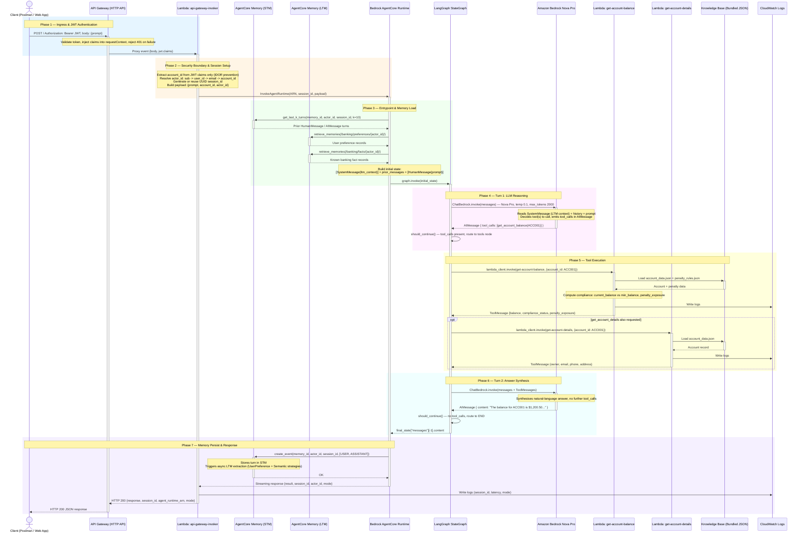
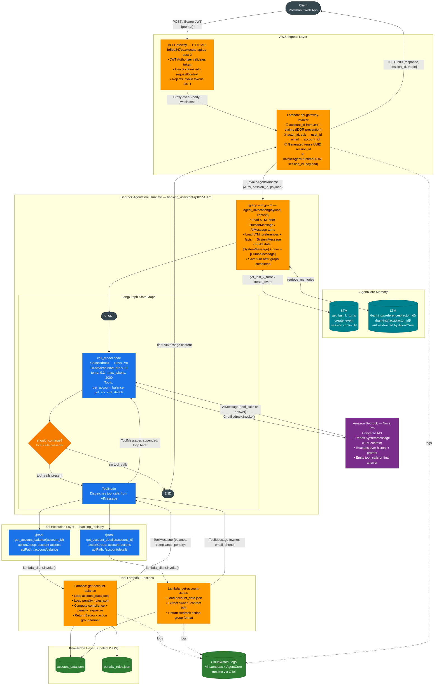

# Banking Assistant — Final Architecture & Execution Flow

## 1. Component Inventory

### Functional Responsibility Map

| Path | Component | Responsibility |
|---|---|---|
| `agentcore_langgraph_runtime.py` | AgentCore Runtime Entrypoint | LangGraph graph, LLM wiring, STM + LTM memory, `@app.entrypoint` handler |
| `tools/banking_tools.py` | Tool Layer | LangChain `@tool` wrappers; dispatches to Lambda (prod) or local handlers (dev) |
| `lambda_handlers/` | Local Tool Handlers | Direct Python implementations used in dev/test without Lambda |
| `deploy/lambda/api_gateway_invoker/` | API Gateway Bridge Lambda | Receives HTTP requests, extracts JWT claims, resolves `actor_id`, invokes AgentCore Runtime |
| `deploy/lambda/get_account_balance/` | Balance Tool Lambda | Deployed Lambda package; computes balance + penalty compliance |
| `deploy/lambda/get_account_details/` | Details Tool Lambda | Deployed Lambda package; returns account owner info |
| `data/` | Static Data Store | JSON files bundled into Lambda zips; account records + penalty rules |
| `deploy/iam/` | IAM Policies | Least-privilege role definitions for each execution boundary |
| `.bedrock_agentcore.yaml` | AgentCore Config | Runtime ARN, ECR repo, CodeBuild project, memory config, region |
| `.bedrock_agentcore/Dockerfile` | Container Image | Python 3.10 slim image with uv, OTel instrumentation, non-root user |
| `local_server.py` | Local Dev Server | FastAPI server mirroring the full prod flow; mock + live LLM modes |
| `scripts/setup_memory.py` | Memory Provisioning | One-time script to create AgentCore Memory resource with STM + LTM strategies |
| `deploy/postman/` | Test Collection | Postman collection covering all request types including multi-turn |

---

## 2. AWS Services Inventory & Roles

| AWS Service | Role in System |
|---|---|
| **API Gateway (HTTP API)** | Public HTTPS entry point; JWT authorizer validates tokens and injects claims into Lambda event |
| **Lambda: `api-gateway-invoker`** | Bridges API Gateway to AgentCore; resolves `account_id` + `actor_id` from JWT; generates `session_id`; calls `bedrock-agentcore:InvokeAgentRuntime` |
| **Bedrock AgentCore Runtime** | Managed container runtime hosting the LangGraph agent; handles session lifecycle and scaling |
| **Amazon Bedrock (Nova Pro)** | LLM inference via `ChatBedrock`; model `us.amazon.nova-pro-v1:0`; decides tool calls and synthesises answers |
| **Lambda: `get-account-balance`** | Tool function; reads bundled JSON, computes penalty compliance, returns Bedrock action group format |
| **Lambda: `get-account-details`** | Tool function; reads bundled JSON, returns owner/contact info in Bedrock action group format |
| **Amazon ECR** | Stores the container image for the AgentCore runtime |
| **AWS CodeBuild** | Builds and pushes the container image during `agentcore launch` |
| **S3** | CodeBuild source bucket |
| **CloudWatch Logs** | Log destination for all Lambda functions and the AgentCore runtime (via OTel) |
| **IAM** | Four distinct roles/policies enforcing least-privilege at each execution boundary |
| **AgentCore Memory (STM)** | Short-term memory; restores last 10 turns per `actor_id` + `session_id`; memory ID `agentcore_langgraph_runtime_mem-EhLa086Zic` |
| **AgentCore Memory (LTM)** | Long-term memory; two namespaces per actor: `/banking/preferences/{actor_id}/` (UserPreference) and `/banking/facts/{actor_id}/` (Semantic); auto-populated by AgentCore after each `create_event` |

---

## 3. Production Sequence Diagram



---

## 4. Architecture Flowchart



---

## 5. Detailed Step-by-Step Execution Flow

### Step 1 — Client Request

The client sends `POST /` to the API Gateway endpoint with `{"prompt": "What is the balance for ACC001?"}` and a `Bearer` JWT in the `Authorization` header.

### Step 2 — API Gateway JWT Authorizer

API Gateway's built-in JWT authorizer validates the token signature and expiry. On success it injects the decoded claims into `event.requestContext.authorizer.jwt.claims`. Invalid or missing tokens are rejected with 401 — the Lambda never sees them.

### Step 3 — `api-gateway-invoker` Lambda

The security and routing boundary:

- Extracts `account_id` **from JWT claims only** (never from the request body) to prevent IDOR attacks
- Resolves `actor_id` from JWT claims in order: `sub` → `user_id` → `email` → `account_id` — this is the stable per-user key for AgentCore Memory
- Generates a UUID `session_id` (or reuses one from the body for multi-turn conversations)
- Calls `bedrock-agentcore:InvokeAgentRuntime` with `{prompt, account_id, actor_id}` payload
- Reads the streaming response body and normalises the result envelope

### Step 4 — AgentCore Entrypoint & Memory Load

The `@app.entrypoint` function `agent_invocation(payload, context)`:

1. **STM load** — `_load_prior_messages(actor_id, session_id)` calls `get_last_k_turns(k=10)` and converts results to `HumanMessage` / `AIMessage` objects
2. **LTM load** — `_load_ltm_context(actor_id)` calls `retrieve_memories` on both namespaces and formats the results as a string
3. **State assembly** — builds the LangGraph initial state:

```python
initial_state = {
    "messages": [SystemMessage(ltm_context)] + prior_messages + [HumanMessage(prompt)]
}
```

The `SystemMessage` injects the user's known preferences and banking facts so the LLM personalises responses without those details polluting the raw conversation history.

### Step 5 — LangGraph Graph Execution

The compiled `StateGraph` starts at `START → call_model`.

**`call_model` node** — `ChatBedrock.invoke(messages)` sends the full message list to Nova Pro. The LLM has `get_account_balance` and `get_account_details` tool schemas bound. It returns an `AIMessage` with either `tool_calls` or a direct answer.

**`should_continue` edge** — inspects `state["messages"][-1].tool_calls`:
- tool calls present → route to `tools` node
- no tool calls → route to `END`

**`tools` node** — `ToolNode` dispatches each tool call to `banking_tools.py`, which invokes the corresponding Lambda with a Bedrock action group format payload. Results come back as `ToolMessage` objects appended to state, then the graph loops back to `call_model`.

### Step 6 — Tool Lambda Execution

Each tool Lambda:

- Loads its bundled `data/` JSON files
- Computes the result (`get-account-balance` also evaluates penalty compliance)
- Returns the Bedrock action group response envelope, which the tool layer unwraps into a `ToolMessage`

### Step 7 — Answer Synthesis

On the second `call_model` pass, Nova Pro sees the full conversation including `ToolMessage` results and generates a natural-language final answer with no further tool calls. The graph routes to `END`.

### Step 8 — Memory Persist & Response

After the graph completes:

1. `_save_turn(actor_id, session_id, prompt, final_answer)` calls `create_event` with both the user and assistant messages as a single logical turn
2. AgentCore automatically runs LTM extraction strategies asynchronously — `UserPreference` updates `/banking/preferences/{actor_id}/` and `Semantic` updates `/banking/facts/{actor_id}/`
3. The final answer travels back: `LangGraph → entrypoint → streaming response → InvokerLambda → API Gateway → Client`

**Response envelope:**

```json
{
  "response": "The balance for ACC001 is $1,200.50...",
  "session_id": "d3c959c4-...",
  "agent_runtime_arn": "arn:aws:bedrock-agentcore:...",
  "mode": "aws_bedrock_agentcore"
}
```

---

## 6. Memory Architecture

```
Per invocation — READ
─────────────────────────────────────────────────────────────────
STM  get_last_k_turns(actor_id, session_id, k=10)
     → HumanMessage / AIMessage objects (last 10 turns)
     → prepended to LangGraph message history

LTM  retrieve_memories(/banking/preferences/{actor_id}/)
     retrieve_memories(/banking/facts/{actor_id}/)
     → formatted as SystemMessage injected at position [0]
     → LLM sees user preferences + known facts on every call

Per invocation — WRITE
─────────────────────────────────────────────────────────────────
STM  create_event(actor_id, session_id, [(prompt, USER), (answer, ASSISTANT)])
     → stores raw turn for session continuity

LTM  (async, triggered automatically by AgentCore after create_event)
     UserPreference strategy → /banking/preferences/{actor_id}/
     Semantic strategy       → /banking/facts/{actor_id}/
```

**Identity resolution:**

| Field | Source (priority order) |
|---|---|
| `actor_id` | JWT `sub` → `user_id` → `email` → `account_id` → `"anonymous"` |
| `session_id` | `context.session_id` → `payload["session_id"]` → `"default-session"` |

**Environment variables:**

| Variable | Default | Description |
|---|---|---|
| `AGENTCORE_MEMORY_ID` | `agentcore_langgraph_runtime_mem-EhLa086Zic` | Memory resource ID |
| `AGENTCORE_MEMORY_TURNS` | `10` | Prior STM turns to reload per invocation |

---

## 7. IAM Trust & Permission Boundaries

```
┌──────────────────────────────────────────────────────────────────┐
│  API Gateway Invoker Lambda Role                                  │
│  bedrock-agentcore:InvokeAgentRuntime                            │
│  logs:CreateLogGroup / CreateLogStream / PutLogEvents            │
└──────────────────────────────────────────────────────────────────┘
                           │ invokes
                           ▼
┌──────────────────────────────────────────────────────────────────┐
│  AgentCore Runtime Role  (banking-agentcore-runtime-role)        │
│  Trust: bedrock-agentcore.amazonaws.com                          │
│  bedrock:InvokeModel                                             │
│  bedrock:InvokeModelWithResponseStream                           │
│  lambda:InvokeFunction  (get-account-balance, get-account-details only) │
│  bedrock-agentcore-memory:GetMemory / RetrieveMemoryRecords /    │
│    CreateMemoryEvent                                             │
│  ecr:GetDownloadUrlForLayer / BatchGetImage                      │
│  logs:*                                                          │
└──────────────────────────────────────────────────────────────────┘
                           │ invokes
                           ▼
┌──────────────────────────────────────────────────────────────────┐
│  Tool Lambda Role  (banking-lambda-tools-role)                   │
│  logs:* only                                                     │
│  (No outbound AWS calls — reads only bundled JSON files)         │
└──────────────────────────────────────────────────────────────────┘
```

---

## 8. Deployment Pipeline

```
Developer workstation
        │
        │  agentcore launch -e agentcore_langgraph_runtime.py
        ▼
AWS CodeBuild  (bedrock-agentcore-agentcore_langgraph_runtime-builder)
        │  Source from S3 bucket
        │  Builds Docker image (Dockerfile: uv + Python 3.10 + OTel)
        ▼
Amazon ECR  (573054851765.dkr.ecr.us-east-2.amazonaws.com/
             bedrock-agentcore-agentcore_langgraph_runtime)
        │  Image pushed
        ▼
Bedrock AgentCore Runtime
        │  Pulls image, starts container
        │  Runtime ID: agentcore_langgraph_runtime-P52MOf7Fmi
        ▼
Runtime ready — accepts invoke_agent_runtime calls
```

---

## 9. Data Flow Summary

```
account_data.json ──┐
                    ├──► get-account-balance Lambda ──► ToolMessage (balance + compliance)
penalty_rules.json ─┘

account_data.json ──────► get-account-details Lambda ──► ToolMessage (owner info)

AgentCore STM ──────────► prior HumanMessage / AIMessage turns ──► LangGraph state[0..n-1]

AgentCore LTM ──────────► preferences + facts ──► SystemMessage ──► LangGraph state[0]

All messages ───────────► Nova Pro (reasoning + synthesis) ──► Natural language answer ──► Client

Final answer ───────────► create_event ──► STM (raw turn) + async LTM extraction
```

---

## 10. Message Sequence Example

**Query:** `"What is the balance for ACC001?"`

| # | Type | Content |
|---|---|---|
| 1 | `SystemMessage` | LTM context: user preferences + known banking facts (if any) |
| 2 | `HumanMessage` | *(prior turns restored from STM, if any)* |
| 3 | `HumanMessage` | "What is the balance for ACC001?" |
| 4 | `AIMessage` | `[tool_call: get_account_balance(account_id="ACC001")]` |
| 5 | `ToolMessage` | `{account_id: "ACC001", current_balance: 1200.50, compliance_status: "NON_COMPLIANT", penalty_exposure: 25.00, ...}` |
| 6 | `AIMessage` | "The balance for account ACC001 is $1,200.50. The account is below the $2,500 minimum for Premium Checking and is subject to a $25 monthly fee." |

After step 6, `create_event` persists messages 3 + 6 as a single STM turn, and AgentCore asynchronously extracts LTM facts for future invocations.

---

## 11. Risks, Bottlenecks & Gaps

### Security

- **JWT `account_id` claim dependency**: IDOR protection relies on the JWT containing a custom `account_id` claim. If the token issuer omits it, the code falls back to the request body — silently degrading to an insecure path. This fallback should be removed or logged as a security warning in production.
- **`account_id` in plaintext payload**: `account_id` is passed in the AgentCore payload. If the runtime is invoked directly (bypassing the invoker Lambda), this boundary is lost.

### Performance

- **Cold starts**: Up to three Lambda cold starts can stack — invoker Lambda plus up to two tool Lambdas — adding latency after idle periods.
- **Sequential tool dispatch**: `ToolNode` dispatches tools sequentially by default. If both tools are needed they run one after the other rather than in parallel.
- **Streaming response buffering**: The invoker Lambda reads the full AgentCore streaming body into memory. Very long responses could approach Lambda memory limits.

### Reliability

- **Static knowledge base**: Account data and penalty rules are bundled as JSON inside the Lambda zip. Any data update requires a Lambda redeployment.
- **No retry logic**: Neither the invoker Lambda nor the tool layer implements retries on transient Bedrock or Lambda errors.
- **LTM eventual consistency**: LTM extraction runs asynchronously after `create_event`. Facts from the current turn are not available to the LLM until the next invocation.

### Observability

- OpenTelemetry is enabled via `LANGSMITH_OTEL_ENABLED=true` and the `opentelemetry-instrument` CMD prefix in the Dockerfile. No explicit OTel collector endpoint is configured — traces may be dropped unless the AgentCore runtime provides a sidecar collector.
